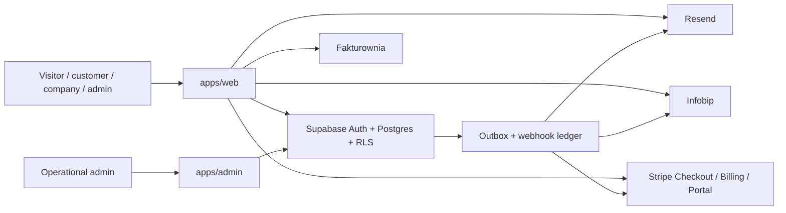

# Architecture

Proworkio is built as a pnpm/Turborepo monorepo with Supabase as the system of record.

## High-level shape

## Repository boundaries

- `apps/web` handles SEO pages, request submission, customer account flows, provider dashboards, and server-side route handlers.
- `apps/admin` handles moderation, billing review, content operations, notifications, webhook inspection, and audit review.
- `packages/types` holds the shared domain contract.
- `packages/lib` holds deterministic matching, pricing, notification fallback, and other cross-app business rules.
- `packages/config` holds environment schemas and shared TypeScript config.
- `packages/openapi` documents custom HTTP endpoints that are not covered by Supabase tables and RPCs.
- `supabase/` is the source of truth for schema, RLS, triggers, seed data, and operational SQL.

## Data and security model

- Public data lives in `public` tables and public-safe views.
- Sensitive contact details live in `private` schema tables and are only exposed through controlled RPCs.
- Billing records live in `billing`.
- Notifications, webhook events, audit logs, and outbox records live in `ops`.
- RLS is the primary authorization boundary.
- Admin access is explicit and role-based, not inferred from the client.

## Domain flow

1. A guest submits a request through `apps/web`.
2. The request is stored in Postgres with `awaiting_confirmation` status and private contact details isolated.
3. Confirmation marks the request active and enqueues matching.
4. Matching writes deterministic, auditable request-company links.
5. Companies see opportunities in their dashboard and can unlock contacts through Stripe checkout.
6. Webhook-confirmed payments create entitlements and invoice sync records.
7. Notifications are orchestrated through a fallback chain and every attempt is recorded.

## Operational principles

- Prefer SQL and RPCs for state changes that need atomicity or auditability.
- Use route handlers or server actions only for app-bound orchestration.
- Prefer outbox-driven side effects over inline provider calls.
- Keep public pages SEO-first and server-rendered.
- Keep admin screens CRUD-oriented and operationally dense.

## Primary commands

- `task bootstrap`
- `task dev`
- `task test`
- `task db:start`
- `task db:reset`
- `task db:types`

